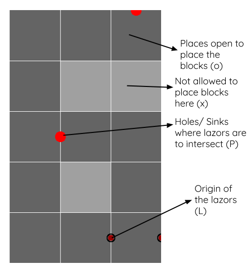

## Lazor Project Group10 -- Welcome to the CPW Lazor App Solver

Here we will attempt to solve the toughest boards you dare to throw at us with our humble yet efficient code.


### How do you use it?

If you're having trouble solving a particular board, dont worry, just get it into a .bff file. 
The .bff file should contain:
```markdown
1. Comments that help you understand the contents of the file
2. The position of blocks and empty movable positions in a grid form
3. Number and types of blocks where:

A - Reflect block 
B - Opaque block
C - Refract block
L - Laser coordinates (origin and direction) 
P - Hole/sink coordinates
```
Once you've made your .bff file use the (insert final file name here) to solve it. Insert the file name in line (insert line number here).


### How does our method work?

The way the code solves a particular board is as such:

We designed a grid for a given board, with each block in the board being a middle point on the block in a grid (like a block surrounded by x's). 
<p align="center">
x x x <br>
x o x <br>
x x x <br>
</p>
This is one block of the grid portraying one block of the board.


The Block function in the class Grid will create a random permutation of the available blocks and movable spaces in the grid and give this permuation to the lazor_path function to solve it. 
<br>
The axes are : horizontal direction is the x axis and vertical deriction is the y axis. 
<br>
The lazor_path checks if for the the given placement of blocks all the lazors hit all the sinks/ holes or not. As soon as it comes across the right grid, the simulation stops and it prints out the correct grid which is the solution to the board.

<p align="center">
   <strong> Yeah we solved it!! </strong>
 </p>


### For you lazy bones out there:

For visual appeal we generated a GUI image (which will be saved in the same directory along with a txt file called solution_textfile.txt with the same information) for the solution where: dark grey blocks as - empty positions (o's) white blocks as - reflect blocks (A's) black blocks as - absorb blocks (B's) cyan blocks as - refract blocks (C's)

Your board should be solved in a maximum of 2 min. Bigger or more complicated boards take longer time. Have fun cheater! (no offense!)

### What we did in these 3 weeks : 

The tough board so given - <br>


The solution we present - <br>

### If your are still confused then Contact :

Charan S. Pasupuleti : spasupu1@jh.edu ,  spasupu1 <br>
Prabhjot K. Luthra : pluthra2@.jh.edu , pluthra2 <br>
Wayne D. Monteiro : wmontei@jh.edu , waynemonteiro97
